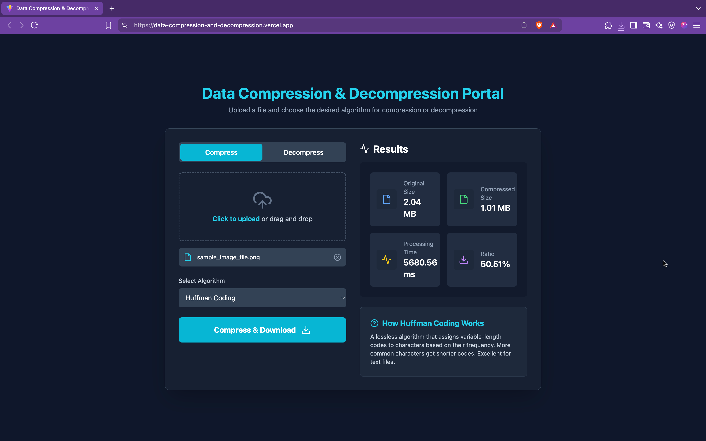
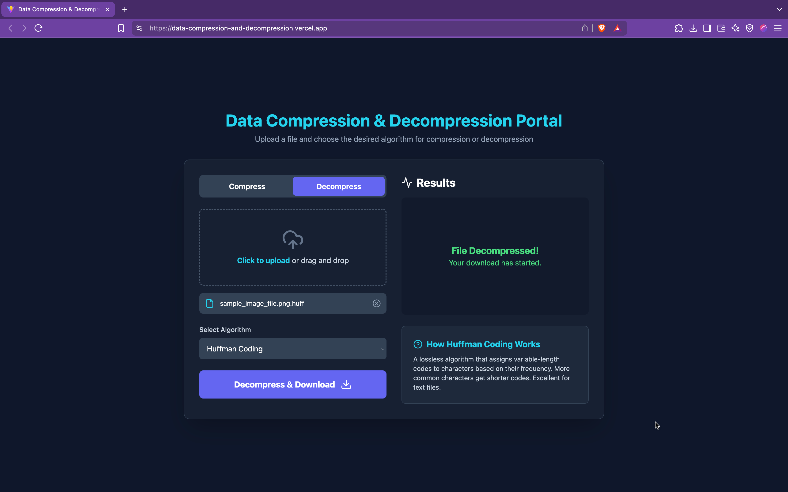

# Data Compression & Decompression Portal

A modern web-based portal for compressing and decompressing files using classical algorithms like Huffman Coding and Run-Length Encoding (RLE).

---

## 🔗 Live Demo

Access the deployed application here:  
**[https://data-compression-and-decompression.vercel.app/](https://data-compression-and-decompression.vercel.app/)**

The backend is hosted at:  
**[https://data-compression-and-decompression-portal.onrender.com](https://data-compression-and-decompression-portal.onrender.com)**

---

## Key Features

### Dual Mode Operation  
- Switch easily between **Compression** and **Decompression** modes with a UI toggle.

### Classic Algorithms  
- **Huffman Coding**: A lossless statistical algorithm, ideal for compressing text-based files.  
- **Run-Length Encoding (RLE)**: Efficient for compressing sequences of repeating characters.

### Detailed Performance Statistics  
After compression, the portal displays:  
- Original and Compressed File Sizes  
- Compression Ratio (%)  
- Server-Side Processing Time (in milliseconds)

### Modern User Experience  
- Drag-and-drop or click-to-upload any file type  
- One-click download of the processed file  
- Dynamic info panel explaining how the selected algorithm works

---

## How It Works: The Architecture

This project follows a decoupled architecture consisting of a React-based frontend and a Flask-based backend.

### Frontend (React + Vite)  
- Built using React and styled with Tailwind CSS  
- SPA (Single Page Application) that uses `axios` to communicate with backend APIs  
- Deployed on Vercel

### Backend (Python + Flask)  
- REST API built using Flask  
- Handles file upload and implements compression/decompression logic in Python  
- Deployed on Render

---

## Tech Stack

| Category    | Technologies                         |
|-------------|--------------------------------------|
| Frontend    | React.js, Vite, Tailwind CSS, axios  |
| Backend     | Python 3, Flask, Gunicorn            |
| Hosting     | Frontend: Vercel<br>Backend: Render  |

---

## Screenshots

- **Homepage**  
  

- **Compression Mode**  
  

- **Decompression Mode**  
  

---

## Local Setup & Reproduction Guide

Follow these steps to run the project locally for development or testing.

### Prerequisites

- Python 3.8+  
- Node.js v16+  
- npm

---

### Step 1: Clone the Repository

```bash
git clone https://github.com/dev-loop1/data-compression-and-decompression-portal.git
cd data-compression-and-decompression-portal

```

### Step 2: Backend Setup (Flask Server)

```bash
cd backend

# Create and activate a virtual environment
# For macOS/Linux:
python3 -m venv venv
source venv/bin/activate

# For Windows:
# python -m venv venv
# .\venv\Scripts\activate

# Install dependencies
pip install -r requirements.txt

# Run the Flask development server
flask run --port 5001
```
The backend server will be running at http://localhost:5001  
Keep this terminal window open

### Step 3: Frontend Setup (React UI)
Open a new terminal window:

```bash

cd frontend

# Install dependencies
npm install

# Run the Vite development server
npm run dev
```
The frontend application will open at http://localhost:5173

### Step 4: Application Ready
The frontend at http://localhost:5173 will communicate with the backend at  
http://localhost:5001 (or the hosted one on Render) to compress or decompress uploaded files.


